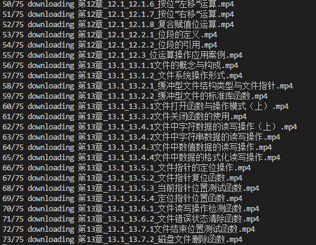

# utils of xuetangx

### What is it

This is a repository which contans some utils of xuetangx

### How to run

##### 1. download_xuetangx_videos

1. install Chrome/[ChromeDriver][chromedriver]/[Python][python]
2. install [selenium][selenium] via `pip install selenium`
3. set `USERNAME`/`PASSWORD`/`COURSEURL` environment variables
4. excute `python download_xuetangx_videos.py`
5. now all the videos are downloaded in `videos` directory

### Features

1. Download videos of xuetangx

### Snapshots

### Program stacks

- [Selenium](http://selenium-python.readthedocs.io/)

### License

GPLv3, see more on [here](http://www.gnu.org/licenses/).

[chromedriver]: https://sites.google.com/a/chromium.org/chromedriver/downloads
[python]: https://www.python.org/
[selenium]: http://selenium-python.readthedocs.io/